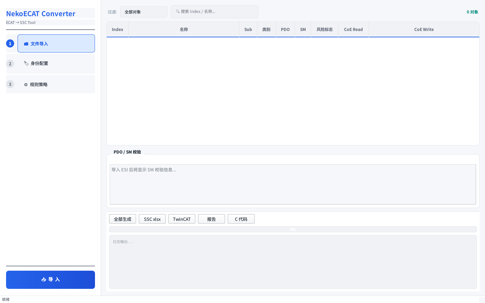

<div align="center">

# 🐱 NekoECAT Converter

**EtherCAT ESI/SDO → SSC Tool xlsx 转换器**

[](https://www.gnu.org/licenses/gpl-3.0)
[](https://python.org)
[](https://qt.io)
[](https://isocpp.org)

</div>

---

## 📖 简介

NekoECAT Converter 是一款专业的 **EtherCAT 从站配置文件转换工具**，能够将 ESI XML 和 SDO 配置文件转换为 SSC Tool 可导入的 xlsx 格式，同时支持生成 TwinCAT ESI、转换报告和 C 代码。

项目采用 **Python 后端 + C++ Qt5 前端** 的架构设计，前后端通过进程间通信完全解耦，保证了代码的可维护性和可扩展性。

### ✨ 核心功能

| 功能 | 说明 |
|------|------|
| 🔍 **ESI XML 解析** | 从 EtherCAT Slave Information 文件提取设备描述、对象字典、PDO 映射 |
| 📋 **SDO 解析** | 支持 XML 和纯文本格式的 SDO 配置文件 |
| 🏷 **对象字典分析** | 自动分类（§9）、风险标记、CoE/PDO/SM 识别 |
| 📊 **SSC Tool xlsx** | 输出符合 SSC Tool Application Description 格式的 Excel 文件 |
| 🔧 **TwinCAT ESI** | 生成 TwinCAT 兼容的 ESI XML 文件 |
| 📝 **转换报告** | 生成详细的 Markdown 格式转换报告 |
| 💻 **C 代码生成** | 自动生成 CoE 回调函数和 PDO 结构体代码 |
| 🖥 **专业 GUI** | C++ Qt5 图形界面，支持实时预览和交互操作 |

---

## 📸 界面预览

<div align="center">



*Light Mode 界面 — 侧边栏导航 + 对象字典表格 + 实时日志*

</div>

---

## 🏗 架构设计

```
┌─────────────────────────────────────────────────┐
│                C++ Qt5 GUI 前端                   │
│  ┌─────────┐  ┌──────────┐  ┌────────────────┐  │
│  │ 侧边栏   │  │ 对象表格  │  │  生成/日志区    │  │
│  │ 导航/配置 │  │ 9列着色  │  │  进度条/输出    │  │
│  └─────────┘  └──────────┘  └────────────────┘  │
│                    │ QProcess                    │
└────────────────────┼────────────────────────────┘
                     │
┌────────────────────┼────────────────────────────┐
│              Python 后端核心                      │
│  ┌────────┐ ┌────────┐ ┌─────────┐ ┌─────────┐ │
│  │ Model  │ │ Parser │ │ Engine  │ │Generator│ │
│  │数据模型 │ │文件解析 │ │规则引擎  │ │输出生成  │ │
│  └────────┘ └────────┘ └─────────┘ └─────────┘ │
│                    │                             │
│              ┌─────┴─────┐                      │
│              │  core.py  │  公共接口              │
│              └───────────┘                      │
└─────────────────────────────────────────────────┘
```

### 🔀 前后端解耦

| 设计决策 | 实现方式 |
|----------|----------|
| 进程隔离 | C++ 通过 `QProcess` 调用 Python CLI |
| 数据交换 | JSON 格式传递设备模型数据 |
| 零耦合 | 前端不 import 任何 Python 模块 |
| 样式分离 | `core/theme` 模块独立管理 UI 样式 |

### 📁 项目结构

```
NekoCAT Converter/
├── nekoecat/                # Python 后端核心 (~3200 行)
│   ├── model/               # Pydantic 数据模型
│   ├── parser/              # ESI XML / SDO 解析器
│   ├── engine/              # 分类器、合并器、规则引擎
│   ├── generator/           # SSC xlsx / ESI / 报告 / C 代码生成
│   ├── log/                 # SSC 日志解析
│   ├── core.py              # 公共门面接口
│   ├── config.py            # 转换配置
│   ├── constants.py         # 常量定义
│   └── utils.py             # 工具函数
├── gui/                 # C++ Qt5 前端 (~2400 行)
│   ├── src/
│   │   ├── core/theme.*     # 主题样式 (解耦)
│   │   ├── mainwindow.*     # 主窗口布局
│   │   ├── worker.*         # 后台转换线程
│   │   └── main.cpp         # 程序入口
│   └── CMakeLists.txt       # CMake 构建配置
├── templates/               # Jinja2 模板
│   ├── coe_callbacks.c.j2   # CoE 回调模板
│   ├── pdo_structs.h.j2     # PDO 结构体模板
│   └── report.md.j2         # 报告模板
├── cli.py                   # 命令行入口
├── main.py                  # Python GUI 入口
├── screenshot.sh            # 截图脚本 (Xvfb)
└── requirements.txt         # Python 依赖
```

---

## 🚀 快速开始

### 环境要求

| 依赖 | 版本 | 用途 |
|------|------|------|
| Python | 3.10+ | 后端运行 |
| Qt5 | 5.15+ | GUI 前端 |
| CMake | 3.16+ | 构建系统 |
| GCC/Clang | 支持 C++17 | 编译器 |

### 安装依赖

```bash
# Python 依赖
pip install -r requirements.txt

# Arch Linux 示例
sudo pacman -S qt5-base cmake gcc
```

### CLI 使用

```bash
# 仅解析 ESI 文件
python cli.py parse --esi D507_ESI.XML

# 完整转换 (ESI + SDO → SSC xlsx)
python cli.py convert \
    --esi D507_ESI.XML \
    --sdo D507_SDO.TXT \
    --out out/d507 \
    --name D507

# 指定模板和输出
python cli.py convert \
    --esi ESI.XML \
    --template digital_io.xlsx \
    --out output/
```

### 构建 C++ GUI

```bash
cd gui
mkdir -p build && cd build
cmake .. -DCMAKE_BUILD_TYPE=Release
make -j$(nproc)

# 运行
./NekoECATConverter
```

### 截图 (用于文档/测试)

```bash
./screenshot.sh                    # 默认输出到 /tmp/nekoecat_screenshot.png
./screenshot.sh /tmp/my_gui.png    # 指定输出路径
```

---

## 📐 转换流程

```
  ① 导入文件          ② 解析设备          ③ 配置策略          ④ 生成输出
┌──────────┐     ┌──────────┐     ┌──────────┐     ┌──────────┐
│ ESI.XML  │────▶│ 对象字典  │────▶│ 规则选项  │────▶│ SSC xlsx │
│ SDO.TXT  │     │ PDO/SM   │     │ 覆盖参数  │     │ TwinCAT  │
│ 模板.xlsx │     │ 身份信息  │     │ 映射模式  │     │ 报告/C代码│
└──────────┘     └──────────┘     └──────────┘     └──────────┘
```

### 对象字典着色规则

| 行颜色 | 含义 |
|--------|------|
| 🟢 浅绿 | PDO 映射对象 |
| 🟡 浅黄 | CoE 读写对象 |
| 🔴 浅红 | 风险标记对象 |
| ⬜ 白/灰 | 正常对象 (交替行) |

---

## 🛠 技术细节

### 后端核心模块

| 模块 | 职责 | 参考章节 |
|------|------|----------|
| `model/` | Pydantic 数据模型，纯数据定义 | — |
| `parser/` | ESI XML 解析、SDO XML/TXT 解析 | — |
| `engine/classifier` | §9 对象分类标记 | Dev Doc §9 |
| `engine/merger` | §8 PDO 方向合并 | Dev Doc §8 |
| `engine/rule_engine` | BOOL/字对齐/回调/SM 验证 | Dev Doc §10 |
| `engine/validator` | 转换结果校验 | Dev Doc §11 |
| `generator/` | SSC xlsx / ESI / 报告 / C 代码 | Dev Doc §11 |

### 前端主题系统

```cpp
// core/theme.h — 集中管理样式常量
namespace Theme {
    inline constexpr auto BG_MAIN    = "#f5f7fa";  // 主背景
    inline constexpr auto ACCENT     = "#2563eb";  // 强调色
    inline constexpr auto TEXT_PRIMARY = "#1f2937"; // 主文字
    
    QPalette lightPalette();           // 亮色模式
    QString globalStyleSheet();        // 全局样式
    QString sidebarStyleSheet();       // 侧边栏样式
    QString tableStyleSheet();         // 表格样式
}
```

---

## 📋 开发指南

### 构建开发版本

```bash
# 后端开发
pip install -e .
python cli.py --help

# 前端开发
cd gui
mkdir -p build && cd build
cmake .. -DCMAKE_BUILD_TYPE=Debug
make -j$(nproc)
```

### 代码规范

- **Python**: 遵循 PEP 8，使用 type hints
- **C++**: C++17 标准，Qt5 风格
- **注释**: 关键模块和复杂逻辑需要中英文注释
- **提交**: 使用语义化提交信息 (`feat:`, `fix:`, `refactor:`, `chore:`)

---

## 📄 许可证

本项目采用 [GNU General Public License v3.0](LICENSE) 许可证。

```
NekoECAT Converter — EtherCAT ESI/SDO → SSC Tool xlsx 转换器
Copyright (C) 2026 NekoRain404

This program is free software: you can redistribute it and/or modify
it under the terms of the GNU General Public License as published by
the Free Software Foundation, either version 3 of the License, or
(at your option) any later version.
```

---

## 🤝 致谢

- [EtherCAT Technology Group](https://www.ethercat.org/) — EtherCAT 协议规范
- [SSC Tool](https://www.ink-hu.com/) — Beckhoff SSC Tool 参考
- [Qt](https://qt.io/) — 跨平台 GUI 框架
- [Pydantic](https://pydantic.dev/) — 数据验证
- [Typer](https://typer.tiangolo.com/) — CLI 框架

---

<div align="center">

**NekoECAT Converter** © 2026 [NekoRain404](https://github.com/NekoRain404) — Licensed under GPL-3.0

</div>
